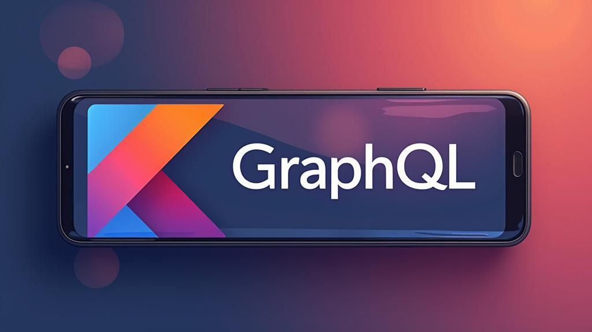

<p align="center">
  <a href="https://android-arsenal.com/api?level=21"></a>
</p>

This is a Kotlin Multiplatform project targeting Android, iOS.

* `/composeApp` is for code that will be shared across your Compose Multiplatform applications.
  It contains several subfolders:
    - `commonMain` is for code that’s common for all targets.
    - Other folders are for Kotlin code that will be compiled for only the platform indicated in the folder name.
      For example, if you want to use Apple’s CoreCrypto for the iOS part of your Kotlin app,
      `iosMain` would be the right folder for such calls.

* `/iosApp` contains iOS applications. Even if you’re sharing your UI with Compose Multiplatform,
  you need this entry point for your iOS app. This is also where you should add SwiftUI code for your project.


## 📷 Previews

<p align="center">


</p>

## 🛠 Tech Stack & Open Source Libraries
- Minimum SDK level 32.
- 100% [Jetpack Compose](https://developer.android.com/jetpack/compose) based + [Coroutines](https://github.com/Kotlin/kotlinx.coroutines)
- Jetpack
 - Compose: Android’s modern toolkit for building native UI.
 - ViewModel: UI related data holder and lifecycle aware.
 - App Startup: Provides a straightforward, performant way to initialize components at application startup.


# 🌍 GraphQLCountry_App

A **Kotlin Multiplatform Mobile (KMM)** application that displays a list of countries using **GraphQL**. Designed to run on both **Android** and **iOS**, this project adopts a modular and scalable architecture for modern mobile development.

---

## 🚀 Technologies Used

- **Kotlin Multiplatform** – Share core business logic across platforms
- **Apollo Kotlin** – Modern GraphQL client tailored for KMM
- **Ktor Client** – Lightweight and asynchronous networking library
- **Jetpack Compose** – Declarative UI framework for Android
- **Koin** – Simple dependency injection framework
- **Coil** – Fast image loading library for Android with Compose support
- **Gradle with Kotlin DSL** – Modern build script configuration
- **MVVM Architecture** – Promotes separation of concerns and testability

---

## 🏛️ Architecture

[Google's official architecture guidance](https://developer.android.com/topic/architecture).

### UI Layer

The UI Layer consists of UI elements like buttons, menus, tabs that could interact with users and [ViewModel](https://www.jetbrains.com/help/kotlin-multiplatform-dev/compose-viewmodel.html) that holds app states and restores data when configuration changes.


## 🗂️ Project Structure

```plaintext
├── adapter/                # GraphQL adapters
├── type/                   # Apollo-generated types
├── selections/             # GraphQL query definitions
├── repository/             # Data handling logic
├── viewModel/              # Presentation layer
├── di/                     # Dependency injection modules
├── ios*/                   # iOS-specific code
├── nativeMain/             # Shared logic between platforms
├── commonTest/             # Shared test cases
├── build.gradle.kts        # Gradle build config
├── libs.versions.toml      # Centralized version catalog


